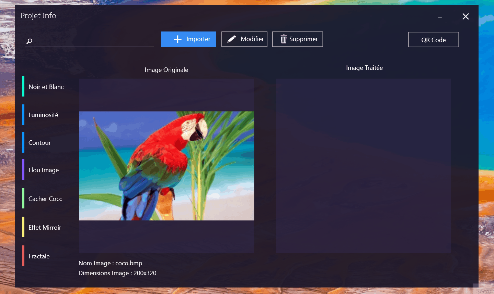
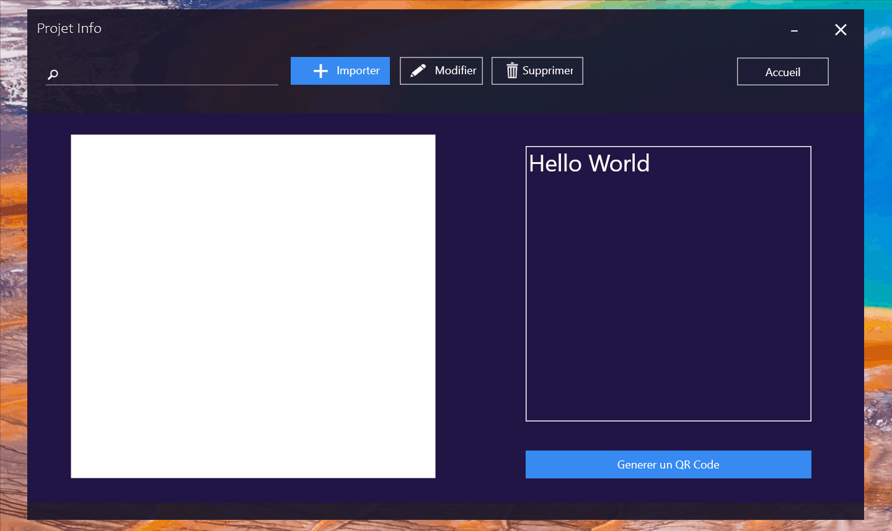

# Image-Processing-and-QR-Code-Generator-WPF

A really cool project with a lot of great features and interesting algorithms. 
THere's two main parts in this software : Image Processing (filtering) and QR Code generation (all worked using Binaries and no librairies)

Preview of Image Processing :

Preview of QR Code generation :

Basically this C# WPF software allows you to do the following :
- Convert any bitmap image to black and white or Grayscal
- Change image brightness
- Edge Detection using Matrix Convolution.
- Blurring image using convolution.
- Create a mirror image.
- Create a Mandelbrot Set Fractal
- Generate a Version 1 QR Code !

All of these were done without using any plugins or libraries, so I had to work using binary of the bitmap image files.
